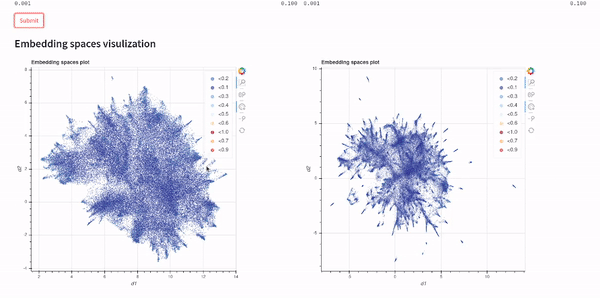
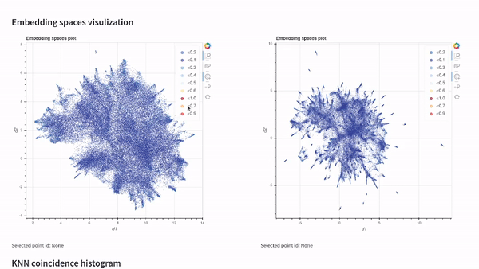

<p align="center">
  
</p>

<p align="center">
    <b> An embedding evaluation toolkit </b>
</p>

<p align="center">
    <a href="https://pypi.org/project/vectory" target="_blank">
        
    </a>
    <a href="https://pypi.org/project/vectory" target="_blank">
        
    </a>
</p>

<p align="center">
  
</p>


Vectory provides a collection of tools to **track and compare embedding versions**.

Visualizing and registering each experiment is a crucial part of developing successful models. Vectory is a tool designed by and for machine learning engineers to handle embedding experiments with little overhead.

### Key features:

- **Embedding linage**. Keep track of the data and models used to generate embeddings.
- **Compare performance**. Compare metrics between different vector spaces.
- **Ease of use**. Easy usage through the CLI, Python, and GUI interfaces.
- **Extensibility**. Built with extensibility in mind.
- **Persistence**. Simple local state persistence using SQLite.

# Table of Contents

1. [Installation](#installation)
2. [Demo](#demo)
3. [Usage](#usage)
4. [Troubleshooting](TROUBLESHOOTING.md)
5. [License](#license)

# Installation

All you need for Vectory to run is to install the package and Elasticsearch. You can install the package using pip:

```console
pip install vectory
```

## Demo

<p align="center">
  
</p>

After installing Vectory, you can play with the demo cases to get a feel of the toolkit.

- Tiny-ImageNet: A computer vision dataset set of embeddings made from pretrained models ResNet50 and ConvNext-tiny.
- IMDB: A NLP dataset set of embeddings made from pretrained models BERT and RoBERTa.

To set up the demo, run the following command:

```console
vectory demo
```

You can specify the demo dataset by adding the name as the next argument. See `vectory demo --help` for more information.


<p align="center">
  
</p>


## Set up Elasticsearch

What is Elasticsearch? It's a free high-performance search engine used for many types of data.

Vectory uses Elasticsearch to load embeddings and then search for them.

To start the engine, you must install Docker and start its daemon.
After that, just run:

```console
vectory elastic up --detach
```

And you can turn it off with:

```console
vectory elastic down
```

# Usage

The key concepts needed to use Vectory are **datasets**, **experiments** and **embedding spaces**.

A **dataset** is just a collection of data. You could have evaluation or training datasets. Evaluation datasets are required for Vectory to run, whereas training datasets are optional and desired for tracking purposes.

You will need a CSV file to define a Datasets. The CSV file must have a header row, followed by a row for each data point in the dataset. The only requirement we ask of the CSV is to have at least an identifier column. The following columns could be labels, features, or any other information.

An **experiment** is a machine learning model trained with a particular dataset. You can create different experiments by varying the model and the dataset. You can optionally specify a training dataset for tracking purposes.

A Dataset and an Experiment form an **embedding space**, which is just a 2-dimensional array with all the generated vectors (namely, features or embeddings) for a particular dataset given an experiment. You will need to provide the embeddings in a file that can be either `.npz` or `.npy`.

The important thing about these embedding files is that they must follow the same indexing as the evaluation dataset CSV file. To summarize, for every line in the dataset, there's an embedding in the `.npz` file.

<details markdown="1">
<summary> <b> Example </b> </summary>

You can have an experiment, such as a ResNet model trained with the dataset Data1. Let’s call the generated embedding space ES1. But either you split your data or you get new data once in a while (or both), so this experiment will not only be used in a static dataset. You might want to use this experiment on Data2 then, generating a particular embedding space called ES2.

Vectory helps you to organize and analyze the obtained embeddings for each dataset and experiment.

</details>

---

# Command Line Interface

## Create

Create datasets, experiments, and embedding spaces:

```console
vectory add --dataset [path_to_csv] --embeddings [path_to_npz]
```

You can see all the options with the `--help` flag.

## Load

Embedding Spaces are links to ElasticSearch **indices**. To load the embeddings to ElasticSearch when creating the Embedding Space, add `--load ` after setting the dataset, the Embedding Space, and the parameters. This option for the `add` command only works for the default loading options. You can use the load command to load the embeddings with different options.

To separately load an Embedding Space to ElasticSearch:

```console
vectory embeddings load [index_name] [embedding_space_name]
```

You can specify the model name, the similarity function, the number of threads, the chunk size, and the hyperparameters for the kNN search. You can see all the options with the `--help` flag.

## Search

**List all** your datasets, experiments, embedding spaces, and indices:

```console
vectory ls
```

**List the indexes:**

```console
vectory embeddings list-indices
```

## Delete

Delete datasets:

```console
vectory dataset delete [dataset_name]
```

**Experiments:**

```console
vectory experiment delete [experiment_name]
```

**Embedding Spaces:**

```console
vectory embeddings delete [embedding_space_name]
```

You can delete elements associated with these objects and their respective indices by adding the `--recursive` flag.

**Indices:**

```console
vectory embeddings delete-index [index_name]
```

**All indices:**

```console
vectory embeddings delete-all-indices
```

### Comparing embedding spaces

With Vectory you can measure how similar two embedding spaces are. The similarity between two embedding spaces is the mean of the local neighborhood similarity of every point, which is the IoU of the ten nearest neighbors.

To compare two embedding spaces, Vectory computes the ten nearest neighbors for every data point for both embedding spaces, getting the IoU for each group of ten nearest neighbors obtained. Then, it shows the distribution of the IoU values. Also, we compute the mean of the IoU values to provide a single value to compare the two embedding spaces.

To learn more about comparing embedding spaces, check out [this embedding-comparator](http://vis.csail.mit.edu/pubs/embedding-comparator/) article.

To compare two embedding spaces, use:

```console
vectory compare [embedding_space_1_name] [embedding_space_2_name] --precompute
```

You can specify the metric for the kNN search in each embedding space. You can also calculate the similarity histogram.

# Python API

## Create

Create datasets, experiments, and an embedding space.

```python
from vectory.datasets import Dataset
from vectory.experiments import Experiment
from vectory.spaces import EmbeddingSpace

dataset = Dataset.get_or_create(csv_path=CSV_PATH, name=DATASET_NAME)

train_dataset = Dataset.get_or_create(csv_path=TRAIN_CSV_PATH, name=TRAIN_DATASET_NAME)

experiment = Experiment.get_or_create(
    train_dataset=TRAIN_DATASET_NAME,
    model=MODEL_NAME,
    name=EXPERIMENT_NAME,
)

embedding_space = EmbeddingSpace.get_or_create(
    npz_path=NPZ_PATH,
    dims=EMBEDDINGS_DIMENSIONS,
    experiment=EXPERIMENT_NAME,
    dataset=DATASET_NAME,
    name=EMBEDDING_SPACE_NAME,
)
```

The `train_dataset` parameter is optional, but we recommend to track the training process.

Load an index on ElasticSearch for an embedding space:

```python
from vectory.indices import load_index

load_index(
    index_name=INDEX_NAME,
    embedding_space_name=EMBEDDING_SPACE_NAME,
)
```

You can get the names of `dataset`, `experiment`, and `embedding_space` objects using `model.name`.

Additionally, you can specify the desired mapping to load the index. You can choose the mapping to use `cosine` or `euclidean` similarity for the kNN search. Searching will be slower but more accurate when using an `exact` model instead of the `lsh`. The `lsh` model and the `cosine` similarity are the default options. To see all the available mappings, check the possible options from `vectory.es.api.Mapping`.

## Search

Get all your datasets, experiments, embedding spaces, and indices:

```python
from vectory.db.models import (
    DatasetModel,
    ElasticSearchIndexModel,
    EmbeddingSpaceModel,
    ExperimentModel,
    Query,
)

datasets = Query(DatasetModel).get()
experiments = Query(ExperimentModel).get()
spaces = Query(EmbeddingSpaceModel).get()
indices = Query(ElasticSearchIndexModel).get()
```

You can also get a specific dataset, experiment, space, or index by specifying an attribute:

```python
dataset = Query(DatasetModel).get(name=DATASET_NAME)[0]
```

## Delete

Delete old datasets and their indices:

```python
from vectory.db.models import  DatasetModel, Query

dataset = Query(DatasetModel).get(name=DATASET_NAME)[0]
dataset.delete_instance(recursive=True)
```

Setting the `recursive` option to `True` deletes the experiments, spaces, and indices associated with the dataset.

The same can be done for experiments, embedding spaces and indices by using the `delete_instance` method on the correct object.

## Compare

With Vectory you can measure how similar two embedding spaces are. The similarity between two embedding spaces is the mean of the local neighborhood similarity of every point, which is the IoU of the ten nearest neighbors. 

Compare two embedding spaces:

```python
from vectory.spaces import compare_embedding_spaces

similarity, _, fig, _ = compare_embedding_spaces(
    embedding_space_a=EMBEDDING_SPACE_NAME_1,
    embedding_space_b=EMBEDDING_SPACE_NAME_2,
    metric_a=METRIC_A,
    metric_b=METRIC_B,
    allow_precompute_knn=True,
)
```

The `metric_a` and `metric_b` parameters are either `euclidean` or `cosine`. The `allow_precompute_knn` parameter is set to `True` to allow precomputing the bulk operations for the similarity computation.

The `spaces_similarity` variable contains the similarity between the two embedding spaces. The `id_similarity_dict` variable has the similarity scores for every point in the embedding spaces.

Setting the `histogram` parameter to `True` in the `compare_embedding_spaces` function will show a histogram of the similarity scores. The `fig` and `ax` variables are the figure and axis of the histogram.

## Reduce dimensionality

Reduce the dimensionality to 2D of an embedding space:

```python
from vectory.visualization.utils import calculate_points, get_index

# Get the embedding space data
embeddings, rows, index = get_index(
    EMBEDDING_SPACE_NAME, model=MODEL, similarity=SIMILARITY_METHOD
)

# Reduce the dimensionality
df = calculate_points(DIMENSIONAL_REDUCTION_MODEL, embeddings, rows)
```

The `calculate_points` function reduces the dimensionality of the embeddings using the `DIMENSIONAL_REDUCTION_MODEL` model. It can be either `UMAP`, `PCA`, or `PCA +` UMAP`. It returns a DataFrame with the reduced dimensionality points and the data contained in the dataset's CSV file.

## Get similar indices

Get the most similar indices for a given embedding:

```python
from vectory.indices import match_query

# Get the most similar indices for a sample embedding
similarity_results, _ = match_query(indices_name=[INDEX_NAME], query_id=EMBEDDING_INDEX)
```

The `match_query` function returns the most similar indices for a given embedding and the index of the embedding. The `indices_name` parameter is a list of indices names, and the `query_id` parameter is the id of the embedding to search. You can get the most similar indices and their scores from these results. The `similarity_results` variable contains a dictionary with the indices' names as keys and a list of tuples with the most similar indices and their scores as values.

# Visualization

Once you have loaded your datasets, experiments, and embedding spaces, you can analyze the results by visualizing them on our Streamlit app or by following the Python API documentation and getting the indices.

## Streamlit

Visualize your embedding spaces on a local Streamlit app:

```console
vectory run
```

The GUI dependencies are required to view the Streamlit app.

# License

This project is licensed under the terms of the MIT license.
